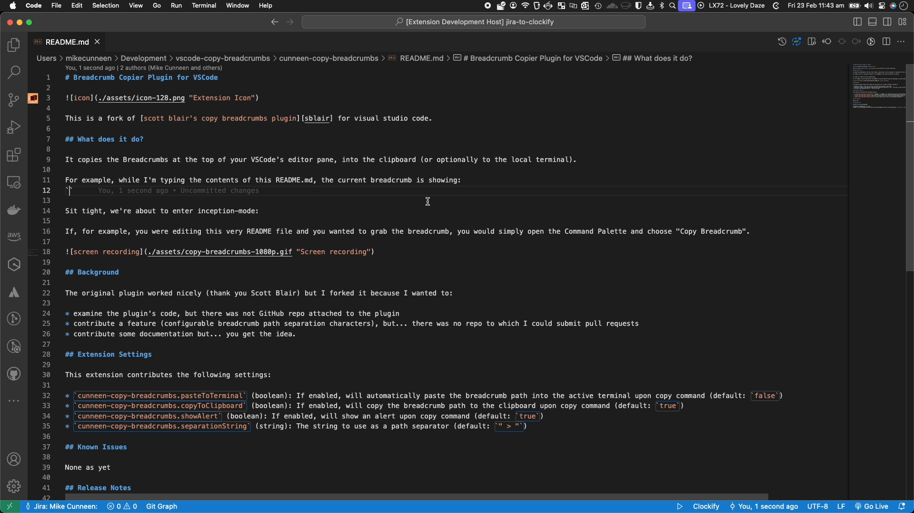

# Breadcrumb Copier Plugin for VSCode

This is a fork of [scott blair's copy breadcrumbs plugin][sblair] for visual studio code.

## What does it do?

Sit tight, we're about to enter inception-mode:

If, for example, you were editing this very README file and you wanted to grab the breadcrumb, you would simply open the Command Palette and choose "Copy Breadcrumb".

## Background

The original plugin worked nicely (thank you Scott Blair) but I forked it because I wanted to:

* examine the plugin's code, but there was not GitHub repo attached to the plugin
* contribute a feature (configurable breadcrumb path separation characters), but... there was no repo to which I could submit pull requests
* contribute some documentation but... you get the idea.

## Extension Settings

This extension contributes the following settings:

* `cunneen-copy-breadcrumbs.pasteToTerminal` (boolean): If enabled, will automatically paste the breadcrumb path into the active terminal upon copy command (default: `true`)
* `cunneen-copy-breadcrumbs.copyToClipboard` (boolean): If enabled, will copy the breadcrumb path to the clipboard upon copy command (default: `true`)
* `cunneen-copy-breadcrumbs.showAlert` (boolean): If enabled, will show an alert upon copy command (default: `true`)
* `cunneen-copy-breadcrumbs.separationString` (string): The string to use as a path separator (default: `"."`)

## Known Issues

None as yet

## Release Notes

See the [Changelog][changelog]

[changelog]: CHANGELOG.md "Changelog"
[sblair]: https://marketplace.visualstudio.com/items?itemName=scott-blair.copy-breadcrumbs "Scott Blair's Copy Breadcrumbs Plugin"
